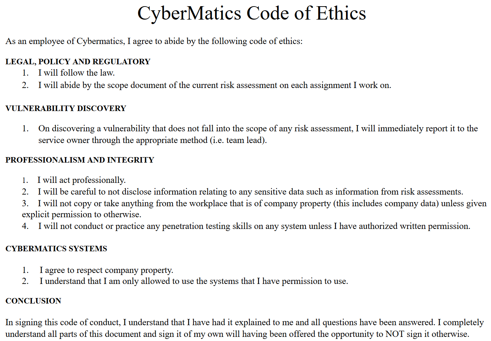
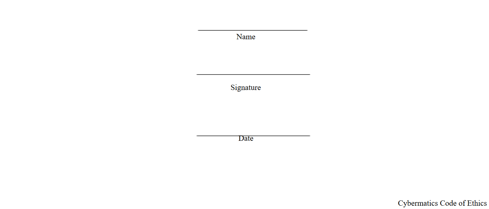
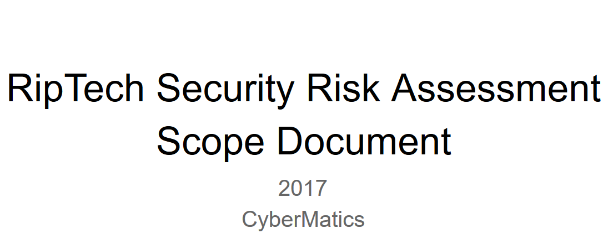
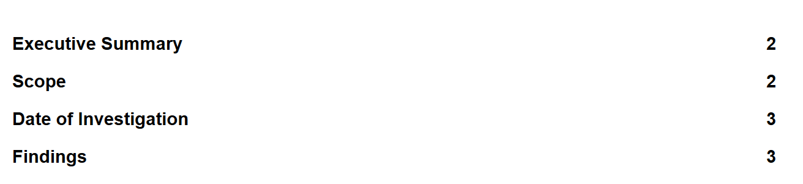
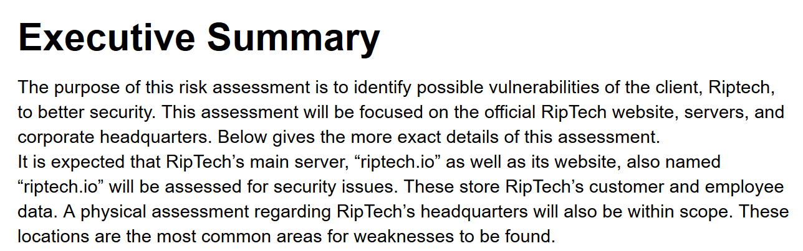
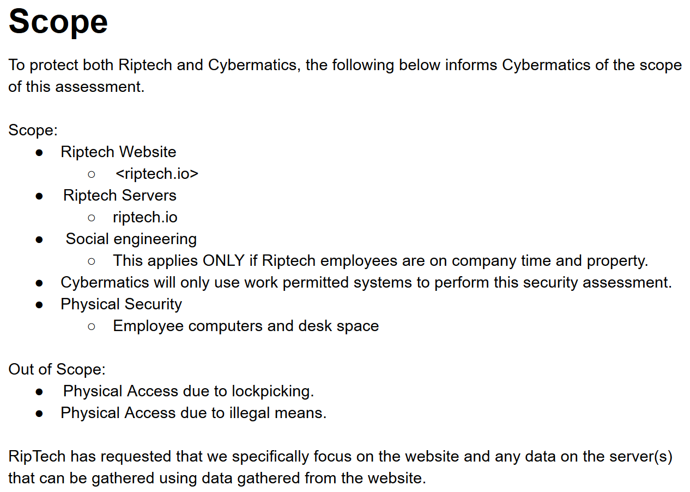
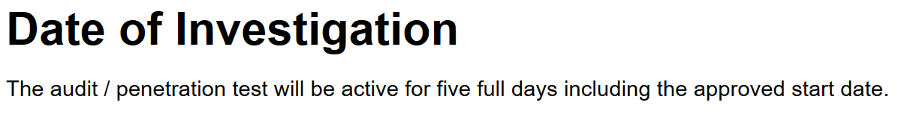
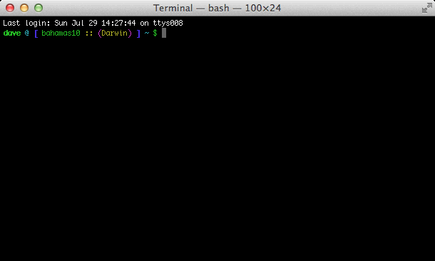

# Getting Started
## Introduction to Documentation
Welcome to the Cybermatics documentation page. In the real world, companies use the practice of documentation in order to ensure that when new people come aboard they can jump right in and figure out how the company chooses to program their structure. This page should be a resource you turn to as you figure out the techniques you need to learn in order to accomplish your daily tasks. Happy hacking! Make sure to read this documentation as thoroughly as possible, as the challenges you encounter will be difficult, but will be discussed within these pages.
###How To Use The Documentation
This documentation is organized into days, with specific terminology associated with those days. If you're having trouble during a specific day's tasks, reference this documentation by visiting the day's task terminology and consulting with it. Below, we'll start out my introducing some common terms you should know:

## Cybersecurity
Cybersecurity is a field study that deals with internet security. All over the world, people and devices are connected to the internet. At the same time, people with bad intentions attempt to gain control of these devices or steal information from these people. The aim of cybersecurity is to make the web a safe space and prevent these malicious individuals from getting past the internet's defenses.
## Penetration Test
A penetration test is a practice that is conducted by having cybersecurity professionals attack a computer, network, or website in order to determine whether or not the defenses put in place will successfully repel against hackers.
## Ethics
> Our code of ethics looks like this:


> 
> 


>


Before you begin your pentest, it's important to make some ethical considerations. Pentesting in and of itself is a somewhat grey area ethically because companies are giving you permission to infiltrate them. This means that we should ensure we are worthy of that level of trust and that we treat this process with the utmost professionalism. We are also expected to follow the law. 
<aside class="notice">
To confirm that ethics are being followed, the paying company is usually given a "scope document" by the cybersecurity company so that they are aware of what practices will be used on their systems.
</aside>

## Red Team
The Red Team is a group of penetration testers that assume the role of the attacking, or bad parties on the internet. These employees will attempt to get through the defenses of whatever they have been assigned to in order to show potential weaknesses. 
## Blue Team
The Blue Team is a group of penetration testers that assume a defensive role during the penetration test. These individuals analyze their target and attempt to bolster its defenses by verifying security measures taken.
## Vulnerability
A vulnerability is a spot within the tested object that could be potentially attacked.
## Compromised System
A compromised system is one that has been broken into by the criminals on the internet. When a compromised status is reached, this means that you cannot trust your ability to freely use your computer, website, or network. 
## Attack
An attack is any method used to attempt to break into your web devices and sites. Now that computers have been around for some time, there are generally only a few types of attacks that are commonly used.
<aside class="notice">
Some of these methods include malware (viruses), SQL Injection (see tab), and social engineering (gaining someone's trust and abusing it). 
</aside>

# Day 1: Preparation

## Scope Documents

> This is the RipTech Scope Document, read it before you advance to day 2. Make sure to stay within the scope during the penetration test.


> 
> 
> 
> 
> 
> 


> 


A scope document is a contract written up by the cybersecurity professionals who are being hired in order to define exactly what can be done during a penetration test. This document specifies what kind of attacks are allowed, what devices are allowed to be tested, how long the test will last, and what other work they will be doing during the test. This ensures that the customer is aware of and agrees with the activities that will be performed during the engagement. 

# Day 2: SQL Injection

## SQL


SQL, which stands for "Structured Query Language," was designed for managing data within a relational database management system. It was one of the first and is still one of the most popular database querying languages.

## Query


A query is a command in SQL for the database. A query can add things to the database, figure out what is inside the database, and also delete things from the database.


> An example of a query or command would be:


```sql
SELECT * FROM Customers;
```
> This query selects all the columns from the Customers table.


## Database

> This query shows us the names of the databases:


```sql
SHOW DATABASES;
```

> This command selects the current database, regardless of name. However, if we replace, `DATABASE()` with a database name we know, we can select that database instead.

```sql
SELECT DATABASE();
``` 

> Similarily, this command will let us see what tables exist in a database once we are using it:

```sql
SHOW TABLES;
```

> In order to find the names of the columns on a table, we need to `SELECT` that information and display it:

```sql
SELECT column_name FROM information_schema.columns WHERE table_name = 'wp_users';
```

> This command requests the column names from the schema, which is essentially the meta data about the database. It also speicifies that it wants the column names from the table named "wp_users". 


A database is a place where a set of data is stored and managed. They can be anything from a database of people that have registered to a particular website, or a list of computers on a given network. The data is organized into tables, and within those tables, columns and rows.
### Tables
Inside a database, everything is organized into tables. Tables store data in columns and rows like the example below:

**Users**

Name | Username | Password |
-----|----------|----------|
Joe  | joeisc00l| password |
Mary | mrybth   | mydogr0x |
Dan  | illidan  | prepared |
 
Name, Username, and Password would be the columns in this case, and the table's name would be Users.  
## Privileges 
Database privileges describe the user's ability to perform specific types of operations on the database. These operations can include deleting information, adding information, editing information, changing the database schema, adding new tables, and more. One user may be able to read from and write to the database, while another may only be able to read. This allows the database administrator to partition access to the database and limit users to only the level of access that they require. 
## SQL Injection


> SQL injection occurs when unauthorized SQL statements are inserted into an input source and executed by the database. This allows attackers to access normally hidden information from the database, tamper with data that exists in the database, delete information from a database, and even give themselves administrative priviledges over a adatabase. One common example is to bypass login prompt on a website and login without proper credentials. 
> To showcase, this allows us to list the users information from a table named wp_user:


```sql
SELECT * FROM wp_user; 
```

> The use of the `*` means we want to select the information from all of the columns in that table. Now, if we want to find just the username and passwords, we use a similar command:

```sql
SELECT user_login, user_pass FROM wp_user;
```


SQL injection involves taking an entry field (such as a place to type your username and password on a website) and then messing with the input so that it accepts SQL commands in an attempt to query the database beyond what it normally does. Doing so allows the hacker to, at the very least, bypass the login page in order to get in without permission, or they could even add themselves as a privileged user. 

<aside class="warning">
You should only attempt SQL injection on systems that you own or have permission to attempt it on.
</aside>  

SQL injection works because websites sometimes don't 'sanatize' their inputs. They are accepting input from strangers, and they assume that the input will be benign and most of the time it will be. But there will the occasional hacker that comes along and tries to enter text that doesn't follow the rules. For example:

This is a simple query that obviously returns the title to the book where author is the input from a variable:
`"SELECT title FROM books WHERE author = '$author';"`

It would look something like this:
`"SELECT title FROM books WHERE author = 'Sanderson';"`


This query will run just fine fine because it is being used as intended.

However, if a single character, such as an apostrophe, is added, it can change the entire syntax of the query. What if I change `$author = "O'Neal"`? The query becomes:
`"SELECT title FROM books WHERE author = 'O'Neal';"`

Notice something wrong? The apostrophe causes the string to break early and the database sees the query: 
`SELECT title FROM books WHERE author = 'O'"Neal;` and we get a syntax error - this is what the SQL injection hackers dream of.

This is a SQL injection - when SQL code is injected into a query that accepts some kind of user input.

If I want to break into a login system that I know has a SQL injection vulnerability. 
`SELECT * FROM users where username='$user' and pass='$pass';`

The variables are `$user` and `$pass`. For $user I provide `admin`, for $pass I provide `noidea' OR 1=1;#`. The query becomes: `SELECT * FROM users where username='admin' and pass='noidea' OR 1=1;#` and I am now logged in as admin.

The `#` is a character most databases will recognize as the beginning of a comment, so I use it here to comment out whatever other SQL code is after the `$pass` variable. I can then run my own query after the original query is complete.

For example, if I want to get the SQL version, I would use `$user = 'whatever'`, `$pass = 'pass UNION SELECT @@version,2,3;#'`
For example, if I want to get the SQL version, I would use `$user = 'whatever'`, `$pass = "pass ' UNION SELECT @@version,2,3;#"`

Don't worry about the `UNION SELECT` too much, it simply allows us to combine select statements with another data set with the same amount of columns.

If I wanted to get the database name, In the password field I would enter `pass ' UNION SELECT database(),2,3;#`

Now this is helpful for the database as a whole, but generally we want to narrow it down and look at the more interesting tables.

To get the table names of the database, I would enter something like this `pass ' UNION SELECT table_name,2,3 from information_schema.tables where table_schema=database();#`

This will give us a list of table names so I can start looking for something that might store sensitive data. Generally there will be some sort of users table that will have password hashes in it. To get the contents from that table I would need to know the table name and the column name, but it's also possible to guess in this case. I would try things like `pass ' UNION SELECT username, password, email from users;#` - changing the 4 names in there until I found what they used.

Once I find what they used and get the password hashes, it's on to the password cracking.


# Day 3: Password Cracking

## Password Security
Password security refers to how hard it is for the password to be guessed or otherwise obtained. Some of these ways you can make your passwords more secure include making your passwords longer, adding special characters (#$!@$), and using capitals or numbers. When possible, passphrases are the recommended option.

## Passphrase
A passphrase is used like a password, but includes multiple words for added security.

> An example of a passphrase:


```
correct horse battery staple
```

## Hashes
Hashing is a way to store passwords securely. This involves scrambling the password in a way that it cannot be read in its plain form. A hashing algorithm takes a string of characters and transforms it into a generally shorter value that represents the original string. It is a one-way function that is generally fast to calculate but almost impossible to guess what the original data was.


### SHA 1

> An example of what a **SHA 1** hash would look like is displayed below:


```shell
38bca521a353930e209c8b49c7b4a1ed4dfa0f38
```


SHA 1 (Secure Hash Alogorithm 1) is one type of hashing algorithm that you can apply to a password. It is an older hashing algorithm and is not recommended for password hashing. SHA 1 always scrambles the password into a 40 character strings.

### SHA 256

> An example of what a **SHA 256** hash would look like is displayed below:


```shell
6b88c087247aa2f07ee1c5956b8e1a9f4c7f892a70e324f1bb3d161e05ca107b
```


SHA 256 is another type of hashing algorithm. It is a newer algorithm than SHA 1 but is still not recommended for use with passwords. SHA 256 always scrambles the password into a 64 character strings.

### MD5
 
> An example of what a **MD5** hash would look like is displayed below


```shell
88ed2a713d1cdb6f7cad9ec6bb4aa4ee
```

MD5 (Message Digest 5) is another type of hashing algorithm. It is an older algorithm that is rarely used.

### bcrypt
 
> An example of what a **bcrypt** hash would look like is displayed below


```shell
$2a$04$rYx2bdmfoJg0.WyhPJHmWu.GsgZ5/KBwafnGe6bfmFaqaBmtN2UUm
```

bcrypt is another type of hashing algorithm that was developed specifically for password hashing. It uses salts and adaptive iteration count to remain safe even with increasing brute-force speeds.
<aside class="notice">
When you create an account on your computer or with a website, the password needs to be stored without the risk that someone could go find the file where it is stored and read your password. This is why passwords are generally hashed before they are stored. If the file is found, it is not the plain text password - it is in a scrambled form that generally cannot be used unless it is cracked. 
</aside>

## How to Crack Passwords
In order to retrieve a password from its hashed form, you will generally make use of password cracking software. In this simulation a program named hashcrack has already been installed in your terminal. By using hashcrack correctly, you can decrypt some of the hashes that you have recovered. 

> Here is how we would pass a command using hashcrack. We'd navigate to the terminal and use:


```shell
hashcrack -t md5 -h ACDD3EE6D517C70F15D7EFB1E036781E44E91D48
```

> Here we use `-t` to specify the type of hash, and `-h` to specify the hash itself. Unfortunately, this method would be very slow, since we are effectively attempting to find every possible word that the MD5 hash could be. This might run for years before finding the password. Using a word list helps us to speed up this process quite a bit.

	 
## Word List

> Word Lists make cracking hashes a lot simpler. By passing in word list (usually a text file with a different word on every line) we give our password cracker a smaller amount of possibilities than every word that ever exisited, making cracking the hash much faster. To do this, we include `-w` like so:

```shell
hashcrack -t sha1 -w /filepath/to/wordlist.txt -h 117d02295a9fc0e0ed05b43dad248530f1dd4505
```

> This lets us say, "the password we're looking for might be on this text file, check against these passwords." This is very helpful to streamline the process. On your cybermatics.io terminal you have a wordlist found at /home/junior/wordlist.txt.


A word list generally refers to a list of commonly-used passwords. There are lists available online of the top million most used passwords in the world. If someone is not careful with their password security it is likely that their password would be found on that list. This is another reason why you should make sure to use strong passwords.

## Password Reuse

Fortunately for penetration testers, users generally have a high rate of password reuse - they use the same password for different accounts/computers. So if we are able to crack one of their password hashes it is highly recommended to try that same password on another account or computer that that user might have access to. You will want to try to use some of the username/password pairs that you cracked today to login to the riptech.io server using ssh.


## SSH


> To ssh, we need to know the username and password of a user and the hostname of the server we are logging into. Then we execute this command in the terminal like so:


```shell
ssh username@hostname
```

> It will then prompt you for the password for that username. We can login directly to a host by simply using `ssh hostname`, but this is assuming you want to login with your current username. 


SSH, or **S**ecure **SH**ell is a tool used to login to a remote system and perform commands. In this simulation you will use SSH to login to the riptech.io server.
 
# Day 4: The Terminal

## Linux
Linux is a type of operating system (like Windows or Mac), but it is much simpler. Many versions of Linux can be run exclusively using a terminal.

## Linux files of importance
When navigating through a linux file system as a pen tester, there are some files that you want to pay special attention to. 

`/etc/passwd` is a file that will show you all of the users on the machine. This is useful to see if you might have any passwords you can reuse, or if there are any users that are not supposed to be there.

`/etc/shadow` is a similar file that lists all of the password hashes for the users on the machine. This is handy if you want to do some serious password cracking, but will generally be too hard for you to crack during the simulation.

To see a log of all of the login and logout events by the different users you can use `/var/log/auth.log` on Ubuntu systems, and `/var/log/secure` on Centos systems. These files include timestamps useful to cooberate file creation times and other logged events.

`/var/www/html` is a folder where generally the files accessable to a web site are located. This folder is also where hackers are likely to place backdoors in order to easily access the server from the Internet.

In the simulation some of these files will be useful in the completion of some tasks. 

## Malicious files
As a pen tester you are always on the lookout for things that seem out of place. Thinking like a hacker will help you to figure out where some of these files may be. If you do find a file that looks malicious be very careful in the way that you handle it. It could be a virus that will spread if you download it to another computer for analysis. Make sure to follow the set procedures and alert your boss.

## Illegal Activity
As a pen tester it is possible that you stumble across illegal activity during a pen test. If you do, it is imperative that you stop what you're doing immediately and alert the authorities. If you continue tampering with the system it can make it more difficult for the authorities to conduct their investigation.

## Terminal (Shell)

> An example of a terminal would look like below:


> 

A terminal (also known as a shell, or a command prompt) is a user interface where a user can enter data or commands to an operating system. It differs from a graphical user interface (GUI) in that it is generally only text-based. The terminal allows some commands to be performed faster, as well as be automated using various programming languages. Commands vary from listing files to running programs. 
## Commands
A command is a phrase that can be entered into the terminal in order to perform an action in the system. On the right is a list of general commands you may use to complete your daily tasks involving the terminal.

### ls - list directory contents
Display information about files specified (the current directory by default)

```shell
ls
ls -la 
```

> Some files can be hidden to the normal view. If the filename starts with a `.` it will not be displayed with just the `ls` command. To include hidden results you must include additional flags such as `-al`. You will need to use this when you are searching for suspicious files on the riptech.io server.

### cd - change directory
One of the commands you will use the most, cd is used to navigate across the file system

> Some examples of common commands are:

```shell
cd /home/user/
cd ..
```

> The first would navigate you to the user folder inside the home folder. The second command takes you back a folder regardless of where you are in the file system. So if you were in the user folder,
you would return to the home folder.

### pwd - current directory
Displays your current location in the file system

```shell
pwd
```

### history 
Displays a list of the previous commands you have entered

```shell
history
```

> Use history with a `-c` flag to clear the history

### hashcrack
Hashcrack is a password cracking program that is installed on your cybermatics.io computer (you won't find it elsewhere). You will want to use this when cracking hashes that you find.

```shell
hashcrack -t sha1 -w /path/to/wordlist.txt -h 8e864f6891daea30887af7166abc194b98ea8641
```

> `-t` is used for the hash type. Hashcrack supports md5, crc32, sha1, and sha256. `-w` is used to specify the path to your wordlist (in this simulation you have a wordlist in your home folder - /home/junior/wordlist.txt). `-h` is used for the hash itself. (Make sure to identify the hash type and use a wordlist when using this command or it might never succeed)

### cat - print file to screen
By using `cat filename` it will print the file you selected to the screen

```shell
cat filename
```

### touch - create new file
By using `touch newfilename` you can create a new file

```shell
touch file1
```

### mkdir - create directory
This command makes a new directory (folder)

```shell
mkdir nameofdirectory
```

### mv - move
Move a file to another location

```shell
mv sourcefilelocation destination
```

### cp - copy
Copy a file to another location. The use of the `-R` flag will copy all of the files in a folder, rather than just one.

```shell
cp sourcefilelocation destination
```

### rm/rmdir - remove
Removes a file or a folder. The use of the `-R` flag will delete all of the files in a folder, rather than just one.

```
rm -R
rmdir
```

### clear
Clears the current terminal view. Does not clear the history

```shell
clear
```

### hostname
Displays the hostname of the computer you are on

```shell
hostname
```

### exit/logout
Allow you exit the terminal or logout of an SSH session.

```shell
exit
logout
``` 

### sudo 
The `sudo` option can be used to authorize a command that your current user does not have permission to run. For example, you might try the command `rm file.txt` to delete a file, that file is owned by someone else. If you are an administrator on the computer you can add sudo -  `sudo rm file.txt` - and be prompted to provide a password, upon which if entered correctly allows you to delete the file. 

```
sudo [command]
```

### whoami/id/who
These are all commands to identify your current user. They each give a little different outputs.

```shell
whoami
id
who
```

### stat
Display meta information about a file

```shell
stat filename
```

> Stat is useful if you want to see metadata such as a file's owner, group, creation date, etc.

### echo 
This command will display whatever you type after it in the terminal.

```shell
echo typesomethinghere
```

### locate
Locate allows you to search the file system for files/folders whose names include the search pattern that you specified. You will want to use this command on the riptech.io server to find the riptech backend files to search for files that shouldn't be there.

```shell
locate pattern
```

>  If I wanted to find all files that included the letters 'etc', I'd use `locate etc`


# Day 5: Technical Reports

> Some good references for penetration test reports:

> <a href="https://www.sans.org/reading-room/whitepapers/bestprac/writing-penetration-testing-report-33343" target="_blank">SANS - Writing a Penetration Testing Report</a>

> <a href="https://www.offensive-security.com/reports/sample-penetration-testing-report.pdf" target="_blank">Offensive Security Sample Report</a>

> <a href="http://www.niiconsulting.com/services/security-assessment/NII_Sample_PT_Report.pdf" target="_blank">NII Consulting Sample Report</a>


The final report in a penetration test makes the difference between good and great pen testing teams. This report defines everything the team found and will be used by the client to fix their systems. A penetration test by itself is useless without a report to give to the client. These reports can be quite large. However, for this simulation we are cutting back a bit to get your best thoughts.

You will fill out an executive summary: give the client a high level view of what we found and how it could affect his business in simple terms. Make sure it's clear and concise - don't use too many words if you don't have to.

Following that is the process section: here give a more detailed description of what the team did each day. Describe the processes by which you were able to break in to their systems - this should include specific usernames, passwords, URLs, files found, etc. You can also include fixes for problems if you wish.

Finally, the conclusion: restate the high level areas of your first 2 sections, end on a positive note encouraging the client to listen to the reports advice and improve their systems.

