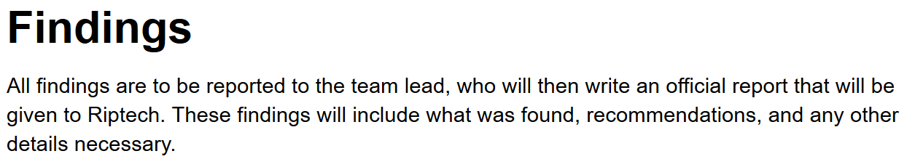

# Getting Started
## Introduction to Documentation
Welcome to the Cybermatics documentation page. In the real world, companies use the practice of documentation in order to ensure that when new people come aboard they can jump right in and figure out how the company chooses to program their structure. This page should be a resource you turn to as you figure out the techniques you need to learn in order to accomplish your daily tasks. Happy hacking! Make sure to read this documentation as thoroughly as possible, as the challenges you encounter will be difficult, but will be discussed within these pages.
###How To Use The Documentation
This documentation is organized into days, with specific terminology associated with those days. If you're having trouble during a specific day's tasks, reference this documentation by visiting the day's task terminology and consulting with it. Below, we'll start out my introducing some common terms you should know:

## Cybersecurity
Cybersecurity is a field study that deals with internet security. All over the world, people and devices are connected to the internet. At the same time, people with bad intentions attempt to gain control of these devices or steal information from these people. The aim of cybersecurity is to make the web a a safe space and prevent these malicious individuals from getting past the internet's defenses.
## Penetration Test
A penetration test is a practice that is conducted by having cybersecurity professionals attack a computer, network, or website in order to determine whether or not the defenses put in place will successfully repel against hackers.
## Ethics
> Our code of ethics looks like this:


> 
> 


>


Before you begin your pentest, it's important to make some ethical considerations. Pentesting in and of itself is a somewhat grey area ethically because companies are giving you permission to infiltrate them. This means that we should ensure we are worthy of that level of trust and that we treat this process with the utmost professionalism. We are also expected to follow the law. 
<aside class="notice">
To confirm that ethics are being followed, the paying company is usually given a "scope document" by the cybersecurity company so that they are aware of what practices will be used on their systems.
</aside>

## Red Team
The Red Team is a group of penetration testers that assume the role of the attacking, or bad parties on the internet. These employees will attempt to get through the defenses of whatever they have been assigned to in order to show potential weaknesses. 
## Blue Team
The Blue Team is a group of penetration testers that assume a defensive role during the penetration test. These individuals analyze their target and attempt to bolster its defenses by verifying security measures taken.
## Vulnerability
A vulnerability is a spot within the tested object that could be potentially attacked.
## Compromised System
A compromised system is one that has been broken into by the criminals on the internet. When a compromised status is reached, this means that you cannot trust your ability to freely use your computer, website, or network. 
## Attack
An attack is any method used to attempt to break into your web devices and sites. Now that computers have been around for some time, there are generally only a few types of attacks that are commonly used.
<aside class="notice">
Some of these methods include malware (viruses), SQL Injection (see tab), and social engineering (gaining someone's trust and abusing it). 
</aside>

# Day 1: Preparation

## Scope Documents

> Our scope document looks like this:


> 
> 
> 
> 
> 
> 


> 


A scope document is essentially a contract written up by the cybersecurity professionals who are being hired. The document specifies to their employer what kind of attacks and work they will be doing on that target. This makes sure that employer is not surprised by any of the measures taken by the penetration testing team. 

# Day 2: SQL Injection

## SQL


SQL, which stands for "Structured Query Language" is one of many programming languages and is specifically used for querying commands to databases.

## Query


A query is a command in SQL for the database. A query can tell the database to add things, figure out what is inside the database, and also delete things.


> An example of a query or command would be:


```sql
SELECT @@VERSION;
```
> This query tells the database to find out what version it is. 


## Database

> This query shows us the name of the database:


```sql
SHOW DATABASE;
```

> Once we know the name of something in the database, we can use the `SELECT` command to use it.

```sql
SELECT DATABASE();
``` 

> This command selects the current database, regardless of name. However, if we replace, `DATABASE()` with a database name we know, we can select that database instead.

> Likewise, this command will let us see what tables exist in a database once we are using it:

```sql
SHOW TABLES;
```

> Now in order to see the columns on a table, we need to `SELECT` that information and display it like so:

```sql
SELECT table_name, column_name FROM information_schema.columns WHERE table_schema = 'wp_users'
```

> This command requests the table name and the column names from the databases schema, which is essentially a map of the database. It then says look for these things in a table named "wp_users". 


A database is a place where data is stored and managed. This can be anything from a database of people that have registered to a particular website, or a list of computers on a given network.
### Tables
Inside a database, everything is organized into tables. Tables store data in columns like the example below:

**Users**

Name | Username | Password |
-----|----------|----------|
Joe  | joeisc00l| password |
Mary | mrybth   | mydogr0x |
Dan  | illidan  | prepared |
 
Name, Username, and Password would be the columns in this case, and the table's name would be Users.  
## Credential
A credential is the means through which a user can prove they should have acess to a website, device, or etc. Credentials act as proof that you, are you. 
<aside class="notice">
The most common type of credential is a password. 
</aside>
## Privileges 
In cybersecurity, privileges describe the ability to perform a task. Tasks can be anything from making or deleting files to updating the database. One person may be able to edit the database, while another doesn't have the privileges to do so. This ensures that employees do not tamper with the wrong things. 
## SQL Injection


> SQL Injections allow us to run any of the example commands you've seen previously through an input on someone's website. This is usually done to gain access to the website. One common example is to find out a username and password of someone on the website and then use it to login. 
> To showcase, this allows us to list the users:


```sql
SELECT * FROM mysql.user; 
```

> The use of the `*` tells us we're listing all of the things in that location. Now, if we want to find the passwords, we use a similar command:

```sql
SELECT user_login, password FROM mysql.user;
```


SQL Injection is one of many hacking methods that involves taking an entry field (such as a place to type your username and password on a website) and then directly typing in SQL commands in an attempt to query the database to modify it. Doing so allows the hacker to, at the very least, find a saved username and password in order to get in without permission, or they could even add themselves as a user. 
<aside class="warning">
This method is not something you should try on another website, though it is safe to do so here within the simulation.
</aside>  


# Day 3: Password Cracking

## Password Security
Password security refers to the measures that are taken to ensure that your password cannot be guessed or identified easily.
<aside class="notice">
Some of these measures include making your passwords longer, adding special characters (#$!@$), and using capitals or numbers. 
</aside>

## Passphrase
A passphrase is nearly identical to a password, with the exception of it being much lengthier.
## Hashes
Hashing is a way to store passwords securely. This involves scrambling the password in some way so that it cannot be read in its plain form. 


### SHA 1

> An example of what a hashed SHA 1 password would look like is displayed below:


```shell
ACDD3EE6D517C70F15D7EFB1E036781E44E91D48
```


SHA 1 (Secure Hash Alogorithm 1) is one specific type of hash encryption that you can apply to password. SHA 1 usually scrambles the password into a 40 digit numbers.

### MD5
 
> An example of what a hashed MD5 password would look like is displayed below


```shell
88ed2a713d1cdb6f7cad9ec6bb4aa4ee
```

MD5 (Message Digest 5) is another type of hashing algorithm that can be applied to passwords. MD5 is stronger than SHA1, but also has vulnerabilities. MD5 wi
ll take any length of password and then output it to an MD5 specified size.

### Password Cracking
In order to retrieve a password from it's hashed form, you often have to use a password cracker. One such method you might use is the built in hashcracker in the terminal. By passing commands through terminal, you can decrypt hashes you may have recovered. 

> Here is how we would pass a command using hashcrack. We'd navigate to the terminal and use:


```shell
hashcrack -t MD5 -h ACDD3EE6D517C70F15D7EFB1E036781E44E91D48
```

> Here we use `-t` to specify the type of hash, and `-h` to specify the hash itself. Unfortunately, this method would be very slow, since we are effectively attempting to find every possible word that the MD5 hash could be. Using a word list, helps solve this problem.

	 
<aside class="notice">
When you make an account on your computer, the computer needs to store this information without the fear that someone could just go find the file where it is stored and read your password. This is why a hash is applied to the password. If the file is found, it's in a scrambled form that is hard to crack. 
</aside>
## Rainbow Tables
A rainbow table is a company's list of all the hashing patterns or ciphers that are being used to protect passwords. For a cybersecurity company, this is a useful tool for unscrambling hashes to prove that the patterns being used may not be secure. 
## Word List

> Word Lists make cracking hashes a lot simpler. By passing in word list (usually a text file) we give our hash cracker a smaller amount of possibilities than every word that ever exisited, making cracking the hash much faster. To do this, we include `-w` like so:

```shell
hashcrack -t md5 -w /filepath/to/wordlist.txt -h ACDD3EE6D517C70F15D7EFB1E036781E44E91D48
```

> This lets us say, "the password we're looking for might be on this text file, check against these passwords." Which is very helpful to streamline the process.


A word list refers to a list of very obvious username and password combinations. Word lists can be used to break into people's accounts by trying all the combinations on the list.
<aside class="notice">
An example of an obvious password combination would be the username = username and password = password. 
</aside> 
## SSH


> To SSH, we need to know the username of someone in the system, and the name of the server we are going to. Then we execute this command in the terminal like so:


```shell
ssh username@hostname
```

> We can go directly to a host by simply using `ssh hostname`, but this is assuming you want to login with your current username. 


SSH, or Secure Shell is a way to login to a system remotely and perform commands. These commands are usually executed in a terminal.
 
# Day 4: The Terminal

## Linux
Linux is a type of operating system (like Windows or Mac), but it is much simpler. Many versions of Linux can be run exclusively using a terminal. 

## Terminal (Shell)

> An example of a terminal would look like below:


> 

A terminal is an application where a user can enter data or commands to a computer. These commands vary from listing files to running programs. 
## Command
A command is a phrase that can be entered into the terminal in order to perform an action in the system. On the right is a list of general commands you may use to complete your daily task involving the terminal.


> Files can be found by adding values to the the `ls` (list) command, like so:

```shell
ls
ls -la 
```

> The list command by itself will list all of the non-hidden files and folders in your current folder directory. With `-la`, this will also add hidden files to your list.


> Some examples of very common commands are:
`cd` which stands for "current directory" and can navigate you through folders.


```shell
cd /home/user/
cd ..
```

> This would navigate you to the folder "user" that's inside the home folder. The second command takes you back a folder. So if you were in the user folder,
you would return to the home folder.


> Other commands that can be useful:


```shell
pwd
```

> This command displays the current directory you are located at. 

```shell
history
```

> This command will show you the history of commands you have typed. 


```shell
cat -n
cat filename
```

> This command is a text manipulator and reader. By using `-n` you create a new file and it will have you start typing in it. By using `cat [filename]` it will open a text editor and let you read that file you've selected.

```shell
touch
touch file1
```

> This command can be used to create files and also modify information about files. `touch file1` makes a new file called file1.


```shell
mkdir nameofdirectory
```

> This command makes a new directory (folder)

```shell
mv sourcefilelocation destination
```

> This command moves an object.

```shell
cp sourcefilelocation destination
```

> This command copies a file. The `-r` and the `-R` specify to copy all of the things in a location, rather than just one. 

```
rm -r -R
rmdir
```

> This command removes a file, or in `rmdir` case, a folder. 


```shell
clear
```

> This command clears the terminal of it's commands for a fresh terminal.


```shell
hostname
```

> This command tells you what the name of the host machine you're accessing is.


```shell
exit
logout
``` 

> These commands help you exit the terminal or logout of an SSH session. 


```
sudo [command]
```

> The `sudo` option can be used as a way to authorize any command that may be password procted. For example, you might try the command `rm file.txt` to delete a file, but you find you don't have permission. By adding `sudo rm file.txt` you will then be prompted to provide a password, upon which if entered correctly allows you to delete the file. 


```shell
whoami
id
```

> These are all commands to identify the user within the terminal. `whoami` will show you who you're logged in as, while `id` shows the number id associated with your user.
 

```shell
echo typesomethinghere
```

> This command will display whatever you type after it in the terminal.

```shell
locate filename directoryname
```

> This command helps you find files where you think they might be. 


# Day 5: Privacy & Law

## Privacy
Privacy, when referring to the internet, is the expectation that when you are using your computer, nobody is spying on you or stealing your information. 
## Technical Reports

> A fake example of a technical report might look like so:

> <a href="http://www.niiconsulting.com/services/security-assessment/NII_Sample_PT_Report.pdf">Click me!</a>


A technical report is written up by the penetration testing team and is used to describe all of the methods actually used during the test, as well as describe the findings that the penetration test found within the employer's system. 
